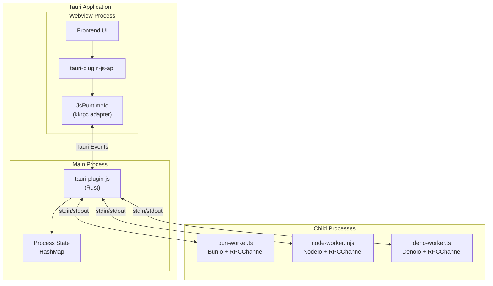
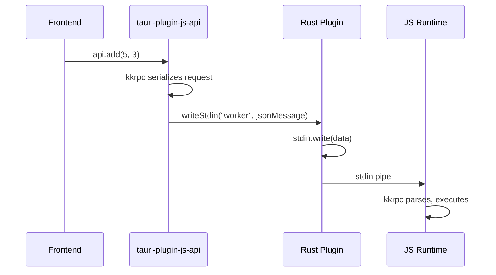
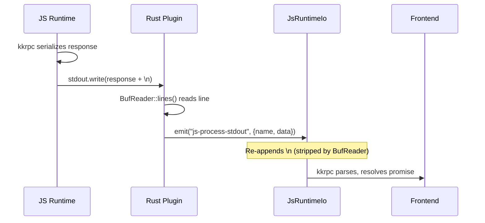
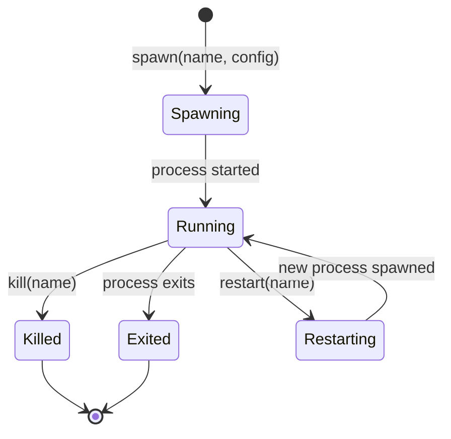

# Architecture Overview

<cite>
**Referenced Files in This Document**
- [src/lib.rs](file://src/lib.rs)
- [src/desktop.rs](file://src/desktop.rs)
- [src/commands.rs](file://src/commands.rs)
- [src/models.rs](file://src/models.rs)
- [guest-js/index.ts](file://guest-js/index.ts)
</cite>

## Table of Contents

1. [System Architecture](#system-architecture)
2. [Component Overview](#component-overview)
3. [Data Flow](#data-flow)
4. [Design Decisions](#design-decisions)

## System Architecture

The plugin follows a **thin relay** architecture where Rust acts as a transparent pipe between the frontend webview and child JS processes.



**Diagram sources**

- [src/desktop.rs](file://src/desktop.rs)
- [guest-js/index.ts](file://guest-js/index.ts)

## Component Overview

### Rust Plugin (Backend)

The Rust plugin consists of four main modules:

| Module | Purpose |
|--------|---------|
| [lib.rs](file://src/lib.rs) | Plugin initialization, command registration, lifecycle hooks |
| [desktop.rs](file://src/desktop.rs) | Desktop implementation — process spawning, stdio piping, event emission |
| [commands.rs](file://src/commands.rs) | Tauri command handlers — thin wrappers around `Js` methods |
| [models.rs](file://src/models.rs) | Data structures — `SpawnConfig`, `ProcessInfo`, event payloads |

**Section sources**

- [src/lib.rs](file://src/lib.rs)
- [src/desktop.rs](file://src/desktop.rs#L1-L25)

### Frontend API (guest-js)

The TypeScript API provides:

| Component | Purpose |
|-----------|---------|
| Command wrappers | `spawn`, `kill`, `restart`, `writeStdin`, etc. |
| Event helpers | `onStdout`, `onStderr`, `onExit` listeners |
| `JsRuntimeIo` | kkrpc `IoInterface` implementation using Tauri events |
| `createChannel` | Factory for type-safe RPC channels |

**Section sources**

- [guest-js/index.ts](file://guest-js/index.ts)

## Data Flow

### RPC Request Flow (Frontend → Runtime)



**Diagram sources**

- [guest-js/index.ts](file://guest-js/index.ts#L75-L77)
- [src/desktop.rs](file://src/desktop.rs#L336-L354)

### RPC Response Flow (Runtime → Frontend)



**Diagram sources**

- [src/desktop.rs](file://src/desktop.rs#L135-L150)
- [guest-js/index.ts](file://guest-js/index.ts#L151-L176)

### Process Lifecycle



**Diagram sources**

- [src/desktop.rs](file://src/desktop.rs#L36-L217)
- [src/desktop.rs](file://src/desktop.rs#L264-L309)

## Design Decisions

### 1. Rust is a Thin Relay

The Rust plugin never parses or transforms RPC messages. It only:
- Spawns child processes
- Pipes stdin/stdout/stderr
- Emits Tauri events for stdout/stderr lines

This keeps the plugin simple and lets kkrpc handle all RPC protocol concerns.

**Section sources**

- [src/desktop.rs](file://src/desktop.rs#L135-L167)

### 2. Newline Framing

Rust's `BufReader::lines()` strips `\n` from each line. The frontend `JsRuntimeIo` adapter re-appends it so kkrpc's message parser works correctly.

```typescript
// guest-js/index.ts
const data = event.payload.data + "\n";
```

**Section sources**

- [src/desktop.rs](file://src/desktop.rs#L140-L141)
- [guest-js/index.ts](file://guest-js/index.ts#L158-L159)

### 3. `isDestroyed` Guard

kkrpc's listen loop continues on null reads. The `JsRuntimeIo` adapter exposes `isDestroyed` and returns a never-resolving promise from `read()` when destroyed, preventing spin loops:

```typescript
async read(): Promise<string | null> {
  if (this._isDestroyed) {
    return new Promise<string | null>(() => {}); // Never resolves
  }
  // ...
}
```

**Section sources**

- [guest-js/index.ts](file://guest-js/index.ts#L182-L195)
- [README.md](file://README.md#L310-L315)

### 4. Async Process Monitoring

The plugin spawns async tasks to monitor each process:
- **stdout/stderr readers** — emit events line-by-line
- **exit watcher** — polls `try_wait()` every 100ms, emits exit event and removes from state

**Section sources**

- [src/desktop.rs](file://src/desktop.rs#L169-L211)

### 5. Mobile Not Supported

The mobile module provides stub implementations that return errors. JS process management is desktop-only.

**Section sources**

- [src/mobile.rs](file://src/mobile.rs)
