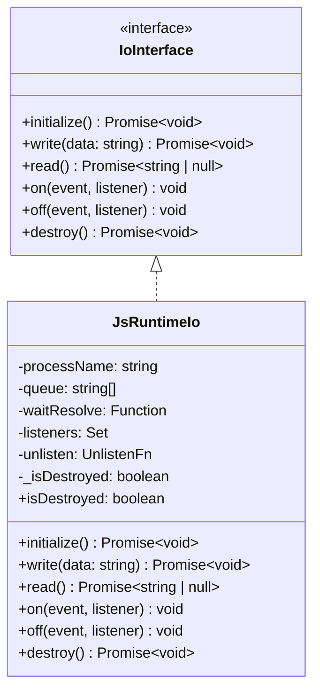

# Frontend API

<cite>
**Referenced Files in This Document**
- [guest-js/index.ts](file://guest-js/index.ts)
- [package.json](file://package.json)
- [tsconfig.json](file://tsconfig.json)
</cite>

## Table of Contents

1. [Overview](#overview)
2. [Type Definitions](#type-definitions)
3. [Command Wrappers](#command-wrappers)
4. [Event Helpers](#event-helpers)
5. [JsRuntimeIo Class](#jsruntimeio-class)
6. [createChannel Helper](#createchannel-helper)

## Overview

The frontend API (`guest-js/index.ts`) is published as `tauri-plugin-js-api` on npm. It provides:

- TypeScript type definitions matching the Rust models
- Command wrappers for all Tauri plugin commands
- Event listeners for stdout/stderr/exit events
- `JsRuntimeIo` class implementing kkrpc's `IoInterface`
- `createChannel` factory for type-safe RPC channels

**Section sources**

- [guest-js/index.ts](file://guest-js/index.ts)
- [package.json](file://package.json)

## Type Definitions

The TypeScript types mirror the Rust models:

```typescript
export interface SpawnConfig {
  runtime?: "bun" | "deno" | "node";
  command?: string;
  sidecar?: string;
  script?: string;
  args?: string[];
  cwd?: string;
  env?: Record<string, string>;
}

export interface ProcessInfo {
  name: string;
  pid: number | null;
  running: boolean;
}

export interface StdioEventPayload {
  name: string;
  data: string;
}

export interface ExitEventPayload {
  name: string;
  code: number | null;
}

export interface RuntimeInfo {
  name: string;
  path: string | null;
  version: string | null;
  available: boolean;
}
```

**Section sources**

- [guest-js/index.ts](file://guest-js/index.ts#L5-L38)

## Command Wrappers

Each command is wrapped with proper typing:

```typescript
export async function spawn(
  name: string,
  config: SpawnConfig,
): Promise<ProcessInfo> {
  return invoke<ProcessInfo>("plugin:js|spawn", { name, config });
}

export async function kill(name: string): Promise<void> {
  return invoke<void>("plugin:js|kill", { name });
}

export async function killAll(): Promise<void> {
  return invoke<void>("plugin:js|kill_all");
}

export async function restart(
  name: string,
  config?: SpawnConfig,
): Promise<ProcessInfo> {
  return invoke<ProcessInfo>("plugin:js|restart", {
    name,
    config: config ?? null,
  });
}

export async function listProcesses(): Promise<ProcessInfo[]> {
  return invoke<ProcessInfo[]>("plugin:js|list_processes");
}

export async function getStatus(name: string): Promise<ProcessInfo> {
  return invoke<ProcessInfo>("plugin:js|get_status", { name });
}

export async function writeStdin(name: string, data: string): Promise<void> {
  return invoke<void>("plugin:js|write_stdin", { name, data });
}

export async function detectRuntimes(): Promise<RuntimeInfo[]> {
  return invoke<RuntimeInfo[]>("plugin:js|detect_runtimes");
}

export async function setRuntimePath(
  runtime: string,
  path: string,
): Promise<void> {
  return invoke<void>("plugin:js|set_runtime_path", { runtime, path });
}

export async function getRuntimePaths(): Promise<Record<string, string>> {
  return invoke<Record<string, string>>("plugin:js|get_runtime_paths");
}
```

**Section sources**

- [guest-js/index.ts](file://guest-js/index.ts#L40-L92)

## Event Helpers

Event helpers filter events by process name:

```typescript
export function onStdout(
  name: string,
  callback: (data: string) => void,
): Promise<UnlistenFn> {
  return listen<StdioEventPayload>("js-process-stdout", (event) => {
    if (event.payload.name === name) {
      callback(event.payload.data);
    }
  });
}

export function onStderr(
  name: string,
  callback: (data: string) => void,
): Promise<UnlistenFn> {
  return listen<StdioEventPayload>("js-process-stderr", (event) => {
    if (event.payload.name === name) {
      callback(event.payload.data);
    }
  });
}

export function onExit(
  name: string,
  callback: (code: number | null) => void,
): Promise<UnlistenFn> {
  return listen<ExitEventPayload>("js-process-exit", (event) => {
    if (event.payload.name === name) {
      callback(event.payload.code);
    }
  });
}
```

Each returns an `UnlistenFn` that can be called to remove the listener.

**Section sources**

- [guest-js/index.ts](file://guest-js/index.ts#L94-L127)

## JsRuntimeIo Class

`JsRuntimeIo` implements kkrpc's `IoInterface` using Tauri events.

### Architecture



**Diagram sources**

- [guest-js/index.ts](file://guest-js/index.ts#L133-L224)

### Key Implementation Details

#### Message Queue

The class maintains a queue for messages that arrive before `read()` is called:

```typescript
private queue: string[] = [];
private waitResolve: ((value: string | null) => void) | null = null;
```

#### Newline Re-appending

Rust's `BufReader::lines()` strips `\n`. The adapter re-appends it:

```typescript
// In the stdout listener
const data = event.payload.data + "\n";
```

#### Push/Pull Pattern

The `read()` method supports both push and pull patterns:

```typescript
async read(): Promise<string | null> {
  if (this._isDestroyed) {
    // Return never-resolving promise to prevent spin loop
    return new Promise<string | null>(() => {});
  }

  if (this.queue.length > 0) {
    return this.queue.shift()!;
  }

  // Wait for next message
  return new Promise<string | null>((resolve) => {
    this.waitResolve = resolve;
  });
}
```

#### isDestroyed Guard

When destroyed, `read()` returns a never-resolving promise:

```typescript
if (this._isDestroyed) {
  return new Promise<string | null>(() => {});
}
```

This prevents kkrpc's listen loop from spinning when the IO adapter is destroyed.

**Section sources**

- [guest-js/index.ts](file://guest-js/index.ts#L129-L224)

## createChannel Helper

`createChannel` is the main entry point for RPC communication:

```typescript
export async function createChannel<
  LocalAPI extends Record<string, any> = Record<string, never>,
  RemoteAPI extends Record<string, any> = Record<string, any>,
>(
  processName: string,
  localApi?: LocalAPI,
): Promise<{
  channel: any;
  api: RemoteAPI;
  io: JsRuntimeIo;
}> {
  const { RPCChannel } = await import("kkrpc/browser");
  const io = new JsRuntimeIo(processName);
  await io.initialize();
  const channel = new RPCChannel<LocalAPI, RemoteAPI>(io, {
    expose: localApi ?? ({} as LocalAPI),
  });
  const api = channel.getAPI();
  return { channel, api: api as RemoteAPI, io };
}
```

### Generic Parameters

- `LocalAPI` — API you expose to the remote side (bidirectional RPC)
- `RemoteAPI` — API the remote side exposes (what you call)

### Return Value

- `channel` — The raw `RPCChannel` instance
- `api` — Typed proxy for calling remote methods
- `io` — The `JsRuntimeIo` instance (for cleanup)

### Usage Example

```typescript
import { createChannel } from "tauri-plugin-js-api";
import type { BackendAPI } from "./shared-api";

const { api, io } = await createChannel<Record<string, never>, BackendAPI>(
  "my-worker"
);

// Type-safe calls
const result = await api.add(5, 3);

// Cleanup when done
await io.destroy();
```

**Section sources**

- [guest-js/index.ts](file://guest-js/index.ts#L226-L247)
