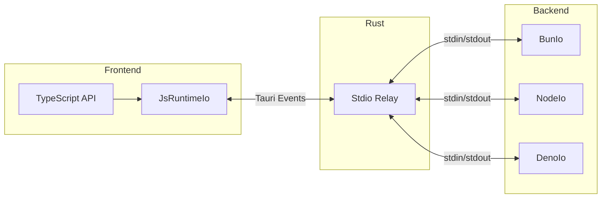

# RPC Communication

<cite>
**Referenced Files in This Document**
- [guest-js/index.ts](file://guest-js/index.ts)
- [src/desktop.rs](file://src/desktop.rs)
- [examples/tauri-app/backends/shared-api.ts](file://examples/tauri-app/backends/shared-api.ts)
- [examples/deno-compile/main.ts](file://examples/deno-compile/main.ts)
</cite>

## Table of Contents

1. [Overview](#overview)
2. [Protocol Design](#protocol-design)
3. [Frontend Integration](#frontend-integration)
4. [Backend Worker Implementation](#backend-worker-implementation)
5. [Type Safety](#type-safety)

## Overview

tauri-plugin-js uses [kkrpc](https://github.com/nicepkg/kkrpc) for type-safe bidirectional RPC between the frontend webview and backend JS processes. The Rust plugin acts as a transparent relay, forwarding raw bytes between the two sides.



**Diagram sources**

- [guest-js/index.ts](file://guest-js/index.ts)
- [src/desktop.rs](file://src/desktop.rs)

## Protocol Design

### Newline-Delimited JSON-RPC

kkrpc uses newline-delimited JSON-RPC messages:

```
{"jsonrpc":"2.0","method":"add","params":[5,3],"id":1}\n
{"jsonrpc":"2.0","result":8,"id":1}\n
```

### Why Newlines?

- Simple framing without parsing entire stream
- Works with `BufReader::lines()` in Rust
- Easy to debug in logs

### Critical: Newline Handling

Rust's `BufReader::lines()` **strips** the `\n` from each line. The frontend must **re-append** it:

```typescript
// guest-js/index.ts
const data = event.payload.data + "\n";
```

Without this, kkrpc's parser would fail because it expects newline-terminated messages.

**Section sources**

- [src/desktop.rs](file://src/desktop.rs#L140-L141)
- [guest-js/index.ts](file://guest-js/index.ts#L158-L159)

## Frontend Integration

### Creating a Channel

```typescript
import { spawn, createChannel } from "tauri-plugin-js-api";
import type { BackendAPI } from "./shared-api";

// 1. Spawn the worker process
await spawn("my-worker", {
  runtime: "bun",
  script: "bun-worker.ts",
  cwd: "/path/to/backends"
});

// 2. Create the RPC channel
const { api, io } = await createChannel<Record<string, never>, BackendAPI>(
  "my-worker"
);

// 3. Make type-safe calls
const result = await api.add(5, 3);
console.log(result); // 8
```

### Bidirectional RPC

You can also expose an API to the worker:

```typescript
interface FrontendAPI {
  log(message: string): Promise<void>;
}

const { api } = await createChannel<FrontendAPI, BackendAPI>(
  "my-worker",
  {
    async log(message) {
      console.log("[worker]", message);
    }
  }
);
```

**Section sources**

- [guest-js/index.ts](file://guest-js/index.ts#L228-L247)

## Backend Worker Implementation

### Shared API Type

Define the API interface once, shared between frontend and workers:

```typescript
// backends/shared-api.ts
export interface BackendAPI {
  add(a: number, b: number): Promise<number>;
  echo(message: string): Promise<string>;
  getSystemInfo(): Promise<{
    runtime: string;
    pid: number;
    platform: string;
    arch: string;
  }>;
  fibonacci(n: number): Promise<number>;
}
```

**Section sources**

- [examples/tauri-app/backends/shared-api.ts](file://examples/tauri-app/backends/shared-api.ts)

### Bun Worker

```typescript
import { RPCChannel, BunIo } from "kkrpc";
import type { BackendAPI } from "./shared-api";

const api: BackendAPI = {
  async add(a, b) { return a + b; },
  async echo(msg) { return `[bun] ${msg}`; },
  async getSystemInfo() {
    return {
      runtime: "bun",
      pid: process.pid,
      platform: process.platform,
      arch: process.arch
    };
  },
  async fibonacci(n) {
    if (n <= 1) return n;
    return (await api.fibonacci(n - 1)) + (await api.fibonacci(n - 2));
  }
};

const io = new BunIo(Bun.stdin.stream());
const channel = new RPCChannel(io, { expose: api });
```

**Section sources**

- [README.md](file://README.md#L122-L137)

### Node Worker

```javascript
import { RPCChannel, NodeIo } from "kkrpc";

const api = { /* same methods */ };

const io = new NodeIo(process.stdin, process.stdout);
const channel = new RPCChannel(io, { expose: api });
```

**Section sources**

- [README.md](file://README.md#L139-L146)

### Deno Worker

```typescript
import { DenoIo, RPCChannel } from "npm:kkrpc/deno";
import type { BackendAPI } from "./shared-api.ts";

const api: BackendAPI = {
  async add(a, b) { return a + b; },
  async echo(msg) { return `[deno] ${msg}`; },
  async getSystemInfo() {
    return {
      runtime: "deno",
      pid: Deno.pid,
      platform: Deno.build.os,
      arch: Deno.build.arch
    };
  },
  async fibonacci(n) {
    if (n <= 1) return n;
    return fibonacci(n - 1) + fibonacci(n - 2);
  }
};

const io = new DenoIo(Deno.stdin.readable);
const channel = new RPCChannel(io, { expose: api });
```

**Section sources**

- [examples/deno-compile/main.ts](file://examples/deno-compile/main.ts)
- [README.md](file://README.md#L148-L156)

## Type Safety

### Compile-Time Checking

The `createChannel` function is generic, enabling full type safety:

```typescript
const { api } = await createChannel<LocalAPI, BackendAPI>("worker");

// ✅ Valid — checked at compile time
const sum = await api.add(5, 3);

// ❌ Type error — method doesn't exist
const foo = await api.nonExistent();

// ❌ Type error — wrong parameter types
const bar = await api.add("five", "three");
```

### Shared Types Pattern

```
project/
├── backends/
│   ├── shared-api.ts      # Shared interface
│   ├── bun-worker.ts      # Imports shared-api
│   └── node-worker.mjs    # Imports shared-api
└── src/
    └── App.svelte         # Imports shared-api
```

All workers and the frontend import from the same `shared-api.ts` file, ensuring type consistency.

**Section sources**

- [examples/tauri-app/backends/shared-api.ts](file://examples/tauri-app/backends/shared-api.ts)
