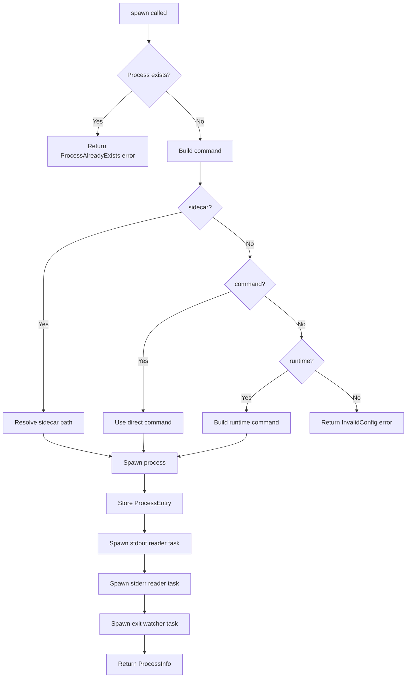

# Rust Plugin

<cite>
**Referenced Files in This Document**
- [src/lib.rs](file://src/lib.rs)
- [src/desktop.rs](file://src/desktop.rs)
- [src/commands.rs](file://src/commands.rs)
- [src/models.rs](file://src/models.rs)
- [src/error.rs](file://src/error.rs)
- [build.rs](file://build.rs)
</cite>

## Table of Contents

1. [Plugin Initialization](#plugin-initialization)
2. [Process Manager (Js Struct)](#process-manager-js-struct)
3. [Command Handlers](#command-handlers)
4. [Data Models](#data-models)
5. [Error Handling](#error-handling)

## Plugin Initialization

The plugin is initialized via the `init()` function in `lib.rs`. This function:

1. Creates a `TauriPlugin` with the name `"js"`
2. Registers all command handlers via `generate_handler![]`
3. Sets up the `Js` state during the `setup` phase
4. Registers an event handler for app exit to kill all processes

```rust
pub fn init<R: Runtime>() -> TauriPlugin<R> {
    Builder::new("js")
        .invoke_handler(tauri::generate_handler![
            commands::spawn,
            commands::kill,
            commands::kill_all,
            commands::restart,
            commands::list_processes,
            commands::get_status,
            commands::write_stdin,
            commands::detect_runtimes,
            commands::set_runtime_path,
            commands::get_runtime_paths,
        ])
        .setup(|app, api| {
            #[cfg(desktop)]
            let js = desktop::init(app, api)?;
            app.manage(js);
            Ok(())
        })
        .on_event(|app, event| {
            if let RunEvent::Exit = event {
                let js = app.state::<Js<R>>();
                tauri::async_runtime::block_on(async {
                    let _ = js.kill_all().await;
                });
            }
        })
        .build()
}
```

**Section sources**

- [src/lib.rs](file://src/lib.rs#L36-L67)

### Extension Trait

The `JsExt` trait provides convenient access to the `Js` state from any Tauri manager:

```rust
pub trait JsExt<R: Runtime> {
    fn js(&self) -> &Js<R>;
}

impl<R: Runtime, T: Manager<R>> crate::JsExt<R> for T {
    fn js(&self) -> &Js<R> {
        self.state::<Js<R>>().inner()
    }
}
```

**Section sources**

- [src/lib.rs](file://src/lib.rs#L24-L33)

## Process Manager (Js Struct)

The `Js<R>` struct in `desktop.rs` is the core process manager.

### State Structure

```rust
struct ProcessEntry {
    child: Child,           // Tokio child process
    stdin: Option<ChildStdin>, // stdin handle for writing
    config: SpawnConfig,    // Original spawn configuration
}

pub struct Js<R: Runtime> {
    app: AppHandle<R>,
    processes: Arc<Mutex<HashMap<String, ProcessEntry>>>,
    runtime_paths: Arc<Mutex<HashMap<String, String>>>,
}
```

**Section sources**

- [src/desktop.rs](file://src/desktop.rs#L12-L22)

### Process Spawning

The `spawn` method:

1. Checks if process name already exists
2. Builds the command based on config (sidecar, command, or runtime)
3. Applies custom runtime path overrides
4. Spawns the process with piped stdio
5. Stores the `ProcessEntry`
6. Spawns async tasks for stdout/stderr reading and exit watching



**Diagram sources**

- [src/desktop.rs](file://src/desktop.rs#L36-L217)

### Stdio Relay

The plugin spawns tokio tasks to read stdout/stderr line-by-line and emit Tauri events:

```rust
// Spawn stdout reader task
if let Some(stdout) = stdout {
    let app = self.app.clone();
    let proc_name = name.clone();
    tauri::async_runtime::spawn(async move {
        let reader = BufReader::new(stdout);
        let mut lines = reader.lines();
        while let Ok(Some(line)) = lines.next_line().await {
            let payload = StdioEventPayload {
                name: proc_name.clone(),
                data: line,
            };
            let _ = app.emit("js-process-stdout", &payload);
        }
    });
}
```

**Section sources**

- [src/desktop.rs](file://src/desktop.rs#L135-L167)

### Exit Watching

The exit watcher polls `try_wait()` every 100ms:

```rust
tauri::async_runtime::spawn(async move {
    loop {
        let exit_status = {
            let mut procs = processes.lock().await;
            if let Some(entry) = procs.get_mut(&proc_name) {
                match entry.child.try_wait() {
                    Ok(Some(status)) => Some(status.code()),
                    Ok(None) => None,
                    Err(_) => Some(None),
                }
            } else {
                break; // Entry was removed (killed)
            }
        };

        if let Some(code) = exit_status {
            let mut procs = processes.lock().await;
            procs.remove(&proc_name);
            let _ = app.emit("js-process-exit", &ExitEventPayload { name: proc_name, code });
            break;
        }

        tokio::time::sleep(std::time::Duration::from_millis(100)).await;
    }
});
```

**Section sources**

- [src/desktop.rs](file://src/desktop.rs#L169-L211)

## Command Handlers

Command handlers in `commands.rs` are thin wrappers that delegate to the `Js` struct:

```rust
#[command]
pub(crate) async fn spawn<R: Runtime>(
    app: AppHandle<R>,
    name: String,
    config: SpawnConfig,
) -> Result<ProcessInfo> {
    app.js().spawn(name, config).await
}
```

All commands follow the same pattern: receive `AppHandle`, access `Js` state via extension trait, call the corresponding method.

**Section sources**

- [src/commands.rs](file://src/commands.rs)

### Registered Commands

| Command | Method | Description |
|---------|--------|-------------|
| `spawn` | `Js::spawn` | Start a named process |
| `kill` | `Js::kill` | Kill a named process |
| `kill_all` | `Js::kill_all` | Kill all processes |
| `restart` | `Js::restart` | Restart a process |
| `list_processes` | `Js::list_processes` | List running processes |
| `get_status` | `Js::get_status` | Get process status |
| `write_stdin` | `Js::write_stdin` | Write to process stdin |
| `detect_runtimes` | `Js::detect_runtimes` | Detect installed runtimes |
| `set_runtime_path` | `Js::set_runtime_path` | Set runtime path override |
| `get_runtime_paths` | `Js::get_runtime_paths` | Get runtime path overrides |

**Section sources**

- [src/commands.rs](file://src/commands.rs)
- [build.rs](file://build.rs#L1-L12)

## Data Models

### SpawnConfig

```rust
#[derive(Debug, Clone, Deserialize, Serialize)]
#[serde(rename_all = "camelCase")]
pub struct SpawnConfig {
    pub runtime: Option<String>,     // "bun", "deno", or "node"
    pub command: Option<String>,     // Direct binary path
    pub sidecar: Option<String>,     // Tauri sidecar binary name
    pub script: Option<String>,      // Script file to run
    pub args: Option<Vec<String>>,   // Additional arguments
    pub cwd: Option<String>,         // Working directory
    pub env: Option<HashMap<String, String>>, // Environment variables
}
```

**Section sources**

- [src/models.rs](file://src/models.rs#L4-L21)

### ProcessInfo

```rust
#[derive(Debug, Clone, Serialize, Deserialize)]
#[serde(rename_all = "camelCase")]
pub struct ProcessInfo {
    pub name: String,
    pub pid: Option<u32>,
    pub running: bool,
}
```

**Section sources**

- [src/models.rs](file://src/models.rs#L23-L29)

### Event Payloads

```rust
#[derive(Debug, Clone, Serialize)]
#[serde(rename_all = "camelCase")]
pub struct StdioEventPayload {
    pub name: String,
    pub data: String,
}

#[derive(Debug, Clone, Serialize)]
#[serde(rename_all = "camelCase")]
pub struct ExitEventPayload {
    pub name: String,
    pub code: Option<i32>,
}
```

**Section sources**

- [src/models.rs](file://src/models.rs#L31-L43)

### RuntimeInfo

```rust
#[derive(Debug, Clone, Serialize, Deserialize)]
#[serde(rename_all = "camelCase")]
pub struct RuntimeInfo {
    pub name: String,
    pub path: Option<String>,
    pub version: Option<String>,
    pub available: bool,
}
```

**Section sources**

- [src/models.rs](file://src/models.rs#L45-L52)

## Error Handling

Errors are defined using `thiserror`:

```rust
#[derive(Debug, thiserror::Error)]
pub enum Error {
    #[error(transparent)]
    Io(#[from] std::io::Error),
    #[error("process not found: {0}")]
    ProcessNotFound(String),
    #[error("process already exists: {0}")]
    ProcessAlreadyExists(String),
    #[error("process not running: {0}")]
    ProcessNotRunning(String),
    #[error("invalid config: {0}")]
    InvalidConfig(String),
    #[error("stdin write error for '{0}': {1}")]
    StdinWriteError(String, String),
}
```

Errors are serializable as strings for Tauri IPC:

```rust
impl Serialize for Error {
    fn serialize<S>(&self, serializer: S) -> std::result::Result<S::Ok, S::Error>
    where
        S: Serializer,
    {
        serializer.serialize_str(self.to_string().as_ref())
    }
}
```

**Section sources**

- [src/error.rs](file://src/error.rs)
