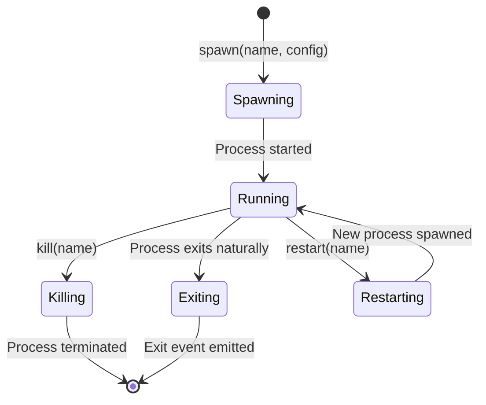
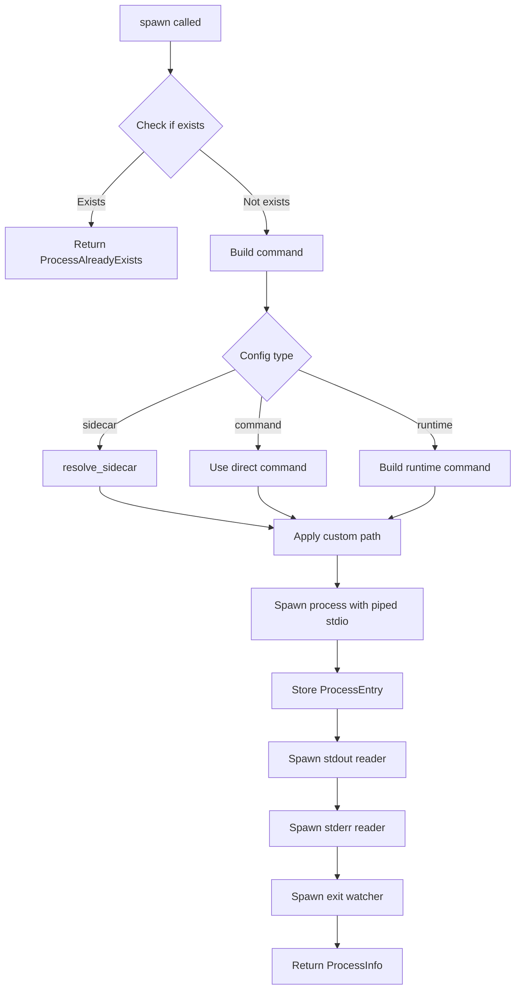

# Process Management

<cite>
**Referenced Files in This Document**
- [src/desktop.rs](file://src/desktop.rs)
- [src/commands.rs](file://src/commands.rs)
- [src/models.rs](file://src/models.rs)
- [guest-js/index.ts](file://guest-js/index.ts)
</cite>

## Table of Contents

1. [Overview](#overview)
2. [Process Lifecycle](#process-lifecycle)
3. [State Management](#state-management)
4. [Stdio Handling](#stdio-handling)
5. [Cleanup on Exit](#cleanup-on-exit)

## Overview

The process management system handles spawning, monitoring, and terminating JS runtime processes. Each process is identified by a unique name and managed independently.



**Diagram sources**

- [src/desktop.rs](file://src/desktop.rs)

## Process Lifecycle

### Spawning

The `spawn` method in `desktop.rs` handles process creation:



**Diagram sources**

- [src/desktop.rs](file://src/desktop.rs#L36-L217)

### Kill

The `kill` method:

1. Removes the process entry from state
2. Drops stdin to signal EOF
3. Kills the child process

```rust
pub async fn kill(&self, name: String) -> crate::Result<()> {
    let mut entry = {
        let mut procs = self.processes.lock().await;
        procs.remove(&name)
            .ok_or_else(|| crate::Error::ProcessNotFound(name.clone()))?
    };

    // Drop stdin first to signal EOF
    entry.stdin.take();
    // Kill the child outside the lock
    let _ = entry.child.kill().await;
    Ok(())
}
```

**Section sources**

- [src/desktop.rs](file://src/desktop.rs#L264-L277)

### Kill All

```rust
pub async fn kill_all(&self) -> crate::Result<()> {
    let entries: Vec<(String, ProcessEntry)> = {
        let mut procs = self.processes.lock().await;
        procs.drain().collect()
    };

    for (_, mut entry) in entries {
        entry.stdin.take();
        let _ = entry.child.kill().await;
    }
    Ok(())
}
```

**Section sources**

- [src/desktop.rs](file://src/desktop.rs#L279-L290)

### Restart

The `restart` method preserves the original config if no new config is provided:

```rust
pub async fn restart(
    &self,
    name: String,
    config: Option<SpawnConfig>,
) -> crate::Result<ProcessInfo> {
    let old_config = {
        let procs = self.processes.lock().await;
        procs.get(&name)
            .map(|e| e.config.clone())
            .ok_or_else(|| crate::Error::ProcessNotFound(name.clone()))?
    };

    self.kill(name.clone()).await?;
    let spawn_config = config.unwrap_or(old_config);
    self.spawn(name, spawn_config).await
}
```

**Section sources**

- [src/desktop.rs](file://src/desktop.rs#L292-L309)

## State Management

### ProcessEntry Structure

```rust
struct ProcessEntry {
    child: Child,              // Tokio async child process
    stdin: Option<ChildStdin>, // Handle for writing to stdin
    config: SpawnConfig,       // Original configuration for restart
}
```

### Js State

```rust
pub struct Js<R: Runtime> {
    app: AppHandle<R>,
    processes: Arc<Mutex<HashMap<String, ProcessEntry>>>,
    runtime_paths: Arc<Mutex<HashMap<String, String>>>,
}
```

The state uses `Arc<Mutex<>>` for thread-safe access from async tasks.

**Section sources**

- [src/desktop.rs](file://src/desktop.rs#L12-L22)

## Stdio Handling

### Stdout Reader

```rust
if let Some(stdout) = stdout {
    let app = self.app.clone();
    let proc_name = name.clone();
    tauri::async_runtime::spawn(async move {
        let reader = BufReader::new(stdout);
        let mut lines = reader.lines();
        while let Ok(Some(line)) = lines.next_line().await {
            let payload = StdioEventPayload {
                name: proc_name.clone(),
                data: line,
            };
            let _ = app.emit("js-process-stdout", &payload);
        }
    });
}
```

**Section sources**

- [src/desktop.rs](file://src/desktop.rs#L135-L150)

### Stderr Reader

Similar to stdout, but emits `js-process-stderr` events.

**Section sources**

- [src/desktop.rs](file://src/desktop.rs#L152-L167)

### Writing to Stdin

```rust
pub async fn write_stdin(&self, name: String, data: String) -> crate::Result<()> {
    let mut procs = self.processes.lock().await;
    let entry = procs.get_mut(&name)
        .ok_or_else(|| crate::Error::ProcessNotFound(name.clone()))?;
    let stdin = entry.stdin.as_mut()
        .ok_or_else(|| crate::Error::ProcessNotRunning(name.clone()))?;
    
    stdin.write_all(data.as_bytes()).await
        .map_err(|e| crate::Error::StdinWriteError(name.clone(), e.to_string()))?;
    stdin.flush().await
        .map_err(|e| crate::Error::StdinWriteError(name, e.to_string()))?;
    Ok(())
}
```

**Section sources**

- [src/desktop.rs](file://src/desktop.rs#L336-L354)

## Cleanup on Exit

### Exit Watcher

The exit watcher polls `try_wait()` every 100ms:

```rust
tauri::async_runtime::spawn(async move {
    loop {
        let exit_status = {
            let mut procs = processes.lock().await;
            if let Some(entry) = procs.get_mut(&proc_name) {
                match entry.child.try_wait() {
                    Ok(Some(status)) => Some(status.code()),
                    Ok(None) => None,
                    Err(_) => Some(None),
                }
            } else {
                break; // Entry was removed (killed)
            }
        };

        if let Some(code) = exit_status {
            let mut procs = processes.lock().await;
            procs.remove(&proc_name);
            let _ = app.emit("js-process-exit", &ExitEventPayload {
                name: proc_name,
                code,
            });
            break;
        }

        tokio::time::sleep(std::time::Duration::from_millis(100)).await;
    }
});
```

**Section sources**

- [src/desktop.rs](file://src/desktop.rs#L169-L211)

### App Exit Handler

The plugin registers an event handler to kill all processes when the app exits:

```rust
.on_event(|app, event| {
    if let RunEvent::Exit = event {
        let js = app.state::<Js<R>>();
        tauri::async_runtime::block_on(async {
            let _ = js.kill_all().await;
        });
    }
})
```

**Section sources**

- [src/lib.rs](file://src/lib.rs#L58-L65)

### Frontend Listener

```typescript
import { onExit } from "tauri-plugin-js-api";

onExit("my-worker", (code) => {
  console.log(`Process exited with code: ${code}`);
});
```

**Section sources**

- [guest-js/index.ts](file://guest-js/index.ts#L118-L127)
