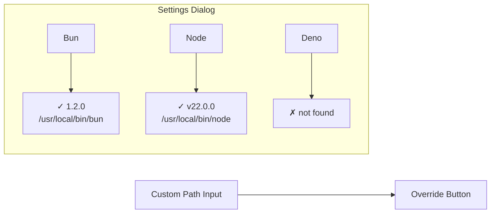

# Runtime Detection

<cite>
**Referenced Files in This Document**
- [src/desktop.rs](file://src/desktop.rs)
- [src/commands.rs](file://src/commands.rs)
- [src/models.rs](file://src/models.rs)
- [guest-js/index.ts](file://guest-js/index.ts)
</cite>

## Table of Contents

1. [Overview](#overview)
2. [Detection Mechanism](#detection-mechanism)
3. [Path Overrides](#path-overrides)
4. [Frontend API](#frontend-api)

## Overview

The plugin can detect installed JS runtimes (Bun, Node.js, Deno) on the user's system, including their paths and versions. This enables:

- UI feedback showing which runtimes are available
- Automatic selection of available runtimes
- Custom path configuration for version-managed installations

**Section sources**

- [src/desktop.rs](file://src/desktop.rs#L356-L397)

## Detection Mechanism

### Implementation

The `detect_runtimes` method checks each runtime by running `--version`:

```rust
pub async fn detect_runtimes(&self) -> crate::Result<Vec<RuntimeInfo>> {
    let runtimes = ["bun", "node", "deno"];
    let mut results = Vec::new();

    for rt in &runtimes {
        // Check version
        let version = tokio::process::Command::new(rt)
            .arg("--version")
            .output()
            .await
            .ok()
            .and_then(|o| {
                if o.status.success() {
                    Some(String::from_utf8_lossy(&o.stdout).trim().to_string())
                } else {
                    None
                }
            });

        // Check path using `which`
        let path = tokio::process::Command::new("which")
            .arg(rt)
            .output()
            .await
            .ok()
            .and_then(|o| {
                if o.status.success() {
                    Some(String::from_utf8_lossy(&o.stdout).trim().to_string())
                } else {
                    None
                }
            });

        let available = version.is_some();
        results.push(RuntimeInfo {
            name: rt.to_string(),
            path,
            version,
            available,
        });
    }

    Ok(results)
}
```

**Section sources**

- [src/desktop.rs](file://src/desktop.rs#L356-L397)

### RuntimeInfo Structure

```rust
#[derive(Debug, Clone, Serialize, Deserialize)]
#[serde(rename_all = "camelCase")]
pub struct RuntimeInfo {
    pub name: String,
    pub path: Option<String>,
    pub version: Option<String>,
    pub available: bool,
}
```

**Section sources**

- [src/models.rs](file://src/models.rs#L45-L52)

### Example Output

```typescript
const runtimes = await detectRuntimes();
// => [
//   { name: "bun", path: "/usr/local/bin/bun", version: "1.2.0", available: true },
//   { name: "node", path: "/usr/local/bin/node", version: "v22.0.0", available: true },
//   { name: "deno", path: null, version: null, available: false }
// ]
```

## Path Overrides

Users can override the detected runtime path, useful for version managers (nvm, fnm, etc.) that install runtimes in non-standard locations.

### Setting a Custom Path

```rust
pub async fn set_runtime_path(
    &self,
    runtime: String,
    path: String,
) -> crate::Result<()> {
    let mut paths = self.runtime_paths.lock().await;
    if path.is_empty() {
        paths.remove(&runtime);
    } else {
        paths.insert(runtime, path);
    }
    Ok(())
}
```

**Section sources**

- [src/desktop.rs](file://src/desktop.rs#L399-L411)

### Getting Custom Paths

```rust
pub async fn get_runtime_paths(&self) -> crate::Result<HashMap<String, String>> {
    let paths = self.runtime_paths.lock().await;
    Ok(paths.clone())
}
```

**Section sources**

- [src/desktop.rs](file://src/desktop.rs#L413-L416)

### Usage in Spawn

When spawning a process, custom paths are applied:

```rust
let program = {
    let custom_paths = self.runtime_paths.lock().await;
    if let Some(ref runtime) = config.runtime {
        custom_paths.get(runtime).cloned().unwrap_or(program)
    } else {
        program
    }
};
```

**Section sources**

- [src/desktop.rs](file://src/desktop.rs#L92-L100)

## Frontend API

### Detecting Runtimes

```typescript
import { detectRuntimes } from "tauri-plugin-js-api";

const runtimes = await detectRuntimes();

runtimes.forEach(rt => {
  if (rt.available) {
    console.log(`${rt.name}: ${rt.version} at ${rt.path}`);
  } else {
    console.log(`${rt.name}: not installed`);
  }
});
```

**Section sources**

- [guest-js/index.ts](file://guest-js/index.ts#L79-L81)

### Setting Custom Paths

```typescript
import { setRuntimePath } from "tauri-plugin-js-api";

// Override node path to use nvm version
await setRuntimePath("node", "/usr/local/nvm/versions/node/v22.0.0/bin/node");

// Clear override (use system default)
await setRuntimePath("node", "");
```

**Section sources**

- [guest-js/index.ts](file://guest-js/index.ts#L83-L88)

### Getting Current Overrides

```typescript
import { getRuntimePaths } from "tauri-plugin-js-api";

const paths = await getRuntimePaths();
// => { node: "/usr/local/nvm/versions/node/v22.0.0/bin/node" }
```

**Section sources**

- [guest-js/index.ts](file://guest-js/index.ts#L90-L92)

### UI Pattern

A typical settings UI shows:



**Diagram sources**

- [README.md](file://README.md#L252-L265)
