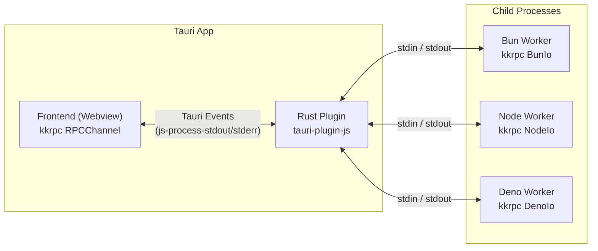
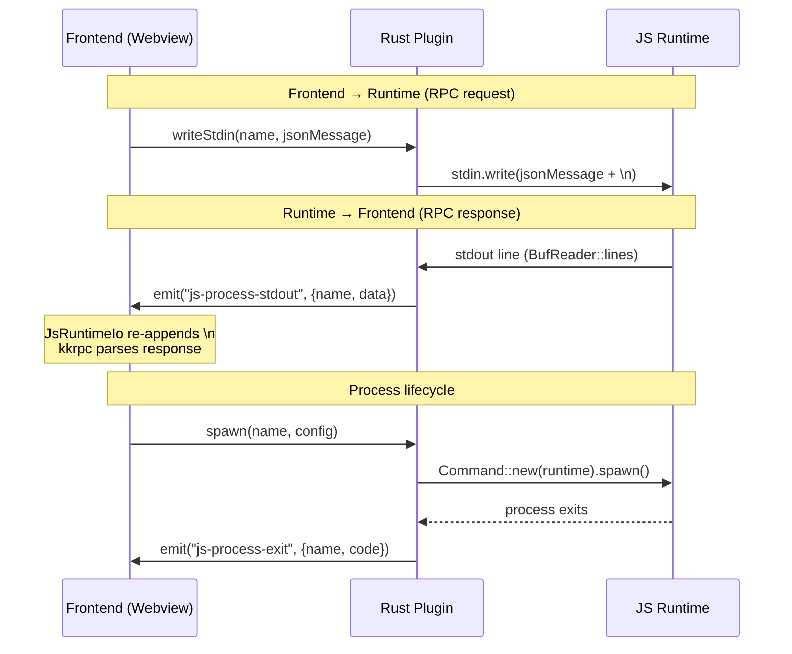

# System Overview

<cite>
**Referenced Files in This Document**
- [Cargo.toml](file://Cargo.toml)
- [package.json](file://package.json)
- [README.md](file://README.md)
- [src/lib.rs](file://src/lib.rs)
</cite>

## Table of Contents

1. [Introduction](#introduction)
2. [What It Enables](#what-it-enables)
3. [Architecture Overview](#architecture-overview)
4. [Technology Stack](#technology-stack)
5. [Project Structure](#project-structure)

## Introduction

**tauri-plugin-js** is a Tauri v2 plugin that spawns and manages JavaScript runtime processes (Bun, Node.js, Deno) from desktop applications. The Rust backend manages process lifecycles and relays stdio via Tauri events, while the frontend communicates with backend JS processes through type-safe RPC powered by [kkrpc](https://github.com/nicepkg/kkrpc).

This plugin bridges the gap between Tauri's lightweight webview shell and scenarios requiring a full JavaScript runtime: filesystem watchers, native modules, long-running compute, local AI inference, dev servers, and more — without the weight of Electron.

**Section sources**

- [Cargo.toml](file://Cargo.toml)
- [README.md](file://README.md#L1-L20)

## What It Enables

- **Run Bun/Node/Deno workers** from a Tauri app with full process lifecycle management
- **Type-safe bidirectional RPC** between frontend and backend JS processes
- **Multiple concurrent named processes** with independent stdio streams
- **Runtime auto-detection** — discovers installed runtimes, paths, and versions
- **Custom runtime executable paths** via settings
- **Compiled binary sidecars** — compile TS workers into standalone executables, no runtime needed on user machines
- **Clean shutdown** on app exit
- **Multi-window support** — all windows can communicate with the same backend processes

**Section sources**

- [README.md](file://README.md#L5-L17)

## Architecture Overview



### Key Design Principle

**Rust is a thin relay.** It spawns processes, pipes stdio, and emits events. It never parses or transforms RPC messages. The RPC protocol layer (kkrpc) runs entirely in JS on both sides.

**Diagram sources**

- [README.md](file://README.md#L19-L36)

### Message Flow



**Diagram sources**

- [README.md](file://README.md#L40-L62)

## Technology Stack

| Component | Technology |
|-----------|------------|
| **Plugin Backend** | Rust (Tauri v2 plugin API) |
| **Frontend API** | TypeScript (kkrpc integration) |
| **Build System** | Cargo + pnpm + Rollup |
| **RPC Protocol** | kkrpc (newline-delimited JSON-RPC) |
| **Async Runtime** | Tokio (process spawning, IO) |
| **Supported Runtimes** | Bun, Node.js, Deno |

**Section sources**

- [Cargo.toml](file://Cargo.toml)
- [package.json](file://package.json)

## Project Structure

```
tauri-plugin-js/
├── src/                    # Rust plugin source
│   ├── lib.rs              # Plugin initialization and registration
│   ├── commands.rs         # Tauri command handlers
│   ├── desktop.rs          # Desktop implementation (process management)
│   ├── mobile.rs           # Mobile stubs (not supported)
│   ├── models.rs           # Data structures (SpawnConfig, ProcessInfo, etc.)
│   └── error.rs            # Error types
├── guest-js/               # Frontend TypeScript API
│   └── index.ts            # spawn, kill, createChannel, JsRuntimeIo
├── dist-js/                # Compiled JavaScript distribution
├── permissions/            # Tauri permission definitions
│   ├── default.toml        # Default permission set
│   └── autogenerated/      # Per-command permissions
├── examples/
│   ├── tauri-app/          # Full demo application
│   └── deno-compile/       # Separate Deno package for compilation
├── vendors/
│   └── kkrpc/              # Vendored kkrpc submodule
├── build.rs                # Build script (permission generation)
├── Cargo.toml              # Rust package configuration
└── package.json            # npm package (tauri-plugin-js-api)
```

**Section sources**

- [src/lib.rs](file://src/lib.rs)
- [guest-js/index.ts](file://guest-js/index.ts)
