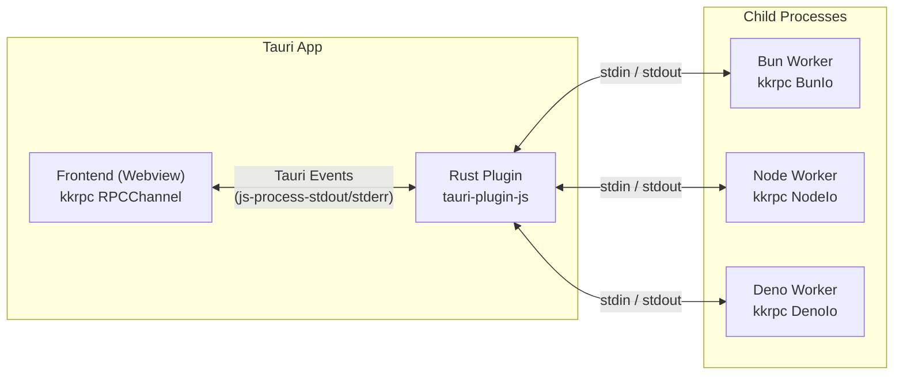
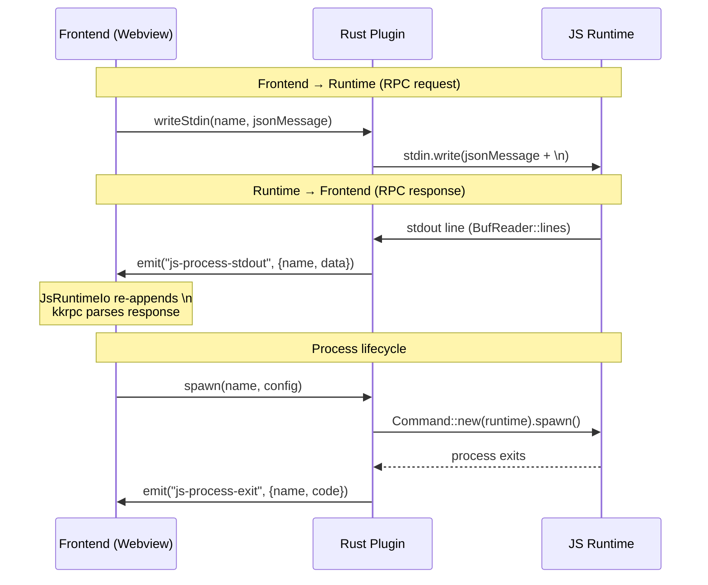

# tauri-plugin-js

A Tauri v2 plugin that spawns and manages JavaScript runtime processes (Bun, Node.js, Deno) from your desktop app. Rust manages process lifecycles and relays stdio via Tauri events. The frontend communicates with backend JS processes through type-safe RPC powered by [kkrpc](https://github.com/nicepkg/kkrpc).

## Why

Tauri gives you a tiny, fast, secure desktop shell — but sometimes you need a full JS runtime for things the webview can't do: filesystem watchers, native modules, long-running compute, local AI inference, dev servers, etc. This plugin bridges that gap without the weight of Electron.

**What it enables:**
- Run Bun/Node/Deno workers from a Tauri app with full process lifecycle management
- Type-safe bidirectional RPC between frontend and backend JS processes
- Multiple concurrent named processes with independent stdio streams
- Runtime auto-detection (discovers installed runtimes, paths, versions)
- Custom runtime executable paths via settings
- Compiled binary sidecars — compile TS workers into standalone executables, no runtime needed on user machines
- Clean shutdown on app exit
- Multi-window support — all windows can communicate with the same backend processes

## Architecture



Rust never parses RPC payloads — it forwards raw newline-delimited strings between the webview and child processes. The RPC protocol layer (kkrpc) runs entirely in JS on both sides.

### Message flow



## Install

### Rust side

Add to your `src-tauri/Cargo.toml`:

```toml
[dependencies]
tauri-plugin-js = { path = "../path/to/tauri-plugin-js" }
# or from git:
# tauri-plugin-js = { git = "https://github.com/user/tauri-plugin-js" }
```

Register in `src-tauri/src/lib.rs`:

```rust
pub fn run() {
    tauri::Builder::default()
        .plugin(tauri_plugin_js::init())
        .run(tauri::generate_context!())
        .expect("error while running tauri application");
}
```

### Frontend side

```bash
pnpm add tauri-plugin-js-api kkrpc
```

### Permissions

Add to `src-tauri/capabilities/default.json`:

```json
{
  "permissions": [
    "core:default",
    "js:default"
  ]
}
```

`js:default` grants all 10 commands: spawn, kill, kill-all, restart, list-processes, get-status, write-stdin, detect-runtimes, set-runtime-path, get-runtime-paths.

## Usage

### 1. Define a shared API type

```typescript
// backends/shared-api.ts
export interface BackendAPI {
  add(a: number, b: number): Promise<number>;
  echo(message: string): Promise<string>;
  getSystemInfo(): Promise<{ runtime: string; pid: number; platform: string; arch: string }>;
}
```

### 2. Write a backend worker

**Bun** (`backends/bun-worker.ts`):
```typescript
import { RPCChannel, BunIo } from "kkrpc";
import type { BackendAPI } from "./shared-api";

const api: BackendAPI = {
  async add(a, b) { return a + b; },
  async echo(msg) { return `[bun] ${msg}`; },
  async getSystemInfo() {
    return { runtime: "bun", pid: process.pid, platform: process.platform, arch: process.arch };
  },
};

const io = new BunIo(Bun.stdin.stream());
const channel = new RPCChannel(io, { expose: api });
```

**Node** (`backends/node-worker.mjs`):
```javascript
import { RPCChannel, NodeIo } from "kkrpc";

const api = { /* same methods */ };
const io = new NodeIo(process.stdin, process.stdout);
const channel = new RPCChannel(io, { expose: api });
```

**Deno** (`backends/deno-worker.ts`):
```typescript
import { DenoIo, RPCChannel } from "npm:kkrpc/deno";
import type { BackendAPI } from "./shared-api.ts";

const api: BackendAPI = { /* same methods, using Deno.pid, Deno.build.os, etc. */ };
const io = new DenoIo(Deno.stdin.readable);
const channel = new RPCChannel(io, { expose: api });
```

### 3. Spawn and call from the frontend

```typescript
import { spawn, createChannel, onStdout, onStderr, onExit } from "tauri-plugin-js-api";
import type { BackendAPI } from "../backends/shared-api";

// Spawn a worker
await spawn("my-worker", { runtime: "bun", script: "bun-worker.ts", cwd: "/path/to/backends" });

// Listen to stdio events
onStdout("my-worker", (data) => console.log("[stdout]", data));
onStderr("my-worker", (data) => console.error("[stderr]", data));
onExit("my-worker", (code) => console.log("exited with", code));

// Create a typed RPC channel
const { api } = await createChannel<Record<string, never>, BackendAPI>("my-worker");

// Type-safe calls — checked at compile time
const sum = await api.add(5, 3);        // => 8
const info = await api.getSystemInfo(); // => { runtime: "bun", pid: 1234, ... }
```

### 4. Spawn a compiled binary sidecar (no runtime needed)

Both Bun and Deno can compile TS workers into standalone executables. Use `sidecar` instead of `runtime` to spawn them via Tauri's sidecar resolution:

```bash
TARGET=$(rustc -vV | grep host | cut -d' ' -f2)

# Bun — compile directly from the project
bun build --compile --minify backends/bun-worker.ts --outfile src-tauri/binaries/bun-worker-$TARGET

# Deno — MUST compile from a separate Deno package (see note below)
deno compile --allow-all --output src-tauri/binaries/deno-worker-$TARGET path/to/deno-package/main.ts
```

> **Important: `deno compile` and `node_modules`**
>
> `deno compile` will crash with a stack overflow if run from a directory that contains `node_modules` — it attempts to traverse and compile everything in the directory tree. **Deno worker source must live in a separate directory** set up as a standalone Deno package (with its own `deno.json` listing dependencies like kkrpc). See [the example app](examples/tauri-app/) for the full setup using `examples/deno-compile/`.

Add `externalBin` to `src-tauri/tauri.conf.json` so Tauri bundles the sidecars:
```json
{ "bundle": { "externalBin": ["binaries/bun-worker", "binaries/deno-worker"] } }
```

```typescript
import { spawn, createChannel } from "tauri-plugin-js-api";

// Spawn the sidecar — no bun/deno/node needed at runtime
await spawn("my-compiled-worker", { sidecar: "bun-worker" });

// RPC works identically — same worker code, same API
const { api } = await createChannel<Record<string, never>, BackendAPI>("my-compiled-worker");
const sum = await api.add(5, 3); // => 8
```

The compiled binaries preserve stdin/stdout behavior, so kkrpc works unchanged. This is the recommended approach for production — end users don't need any JS runtime installed.

The plugin resolves sidecars by looking next to the app executable, trying both plain names (production) and target-triple-suffixed names (development).

### 5. Bundle scripts as resources (for runtime-based spawning in production)

Worker scripts that import `kkrpc` need `node_modules` at runtime. In production, bundle them into self-contained JS files first:

```bash
# Bundle for bun target (inlines kkrpc dependency)
bun build backends/bun-worker.ts --target bun --outfile src-tauri/workers/bun-worker.js

# Bundle for node target
bun build backends/node-worker.mjs --target node --outfile src-tauri/workers/node-worker.mjs
```

Then add the bundled files as Tauri resources in `tauri.conf.json`:
```json
{
  "bundle": {
    "resources": {
      "workers/bun-worker.js": "workers/bun-worker.js",
      "workers/node-worker.mjs": "workers/node-worker.mjs"
    }
  }
}
```

Resolve the script path at runtime:
```typescript
import { resolveResource } from "@tauri-apps/api/path";

const script = await resolveResource("workers/bun-worker.js");
await spawn("my-worker", { runtime: "bun", script });
```

Note: Deno workers use `npm:kkrpc/deno` which Deno resolves natively — no bundling needed, just copy the source file.

### 6. Runtime detection

```typescript
import { detectRuntimes, setRuntimePath, getRuntimePaths } from "tauri-plugin-js-api";

const runtimes = await detectRuntimes();
// => [{ name: "bun", path: "/usr/local/bin/bun", version: "1.2.0", available: true }, ...]

// Override a runtime's executable path
await setRuntimePath("node", "/usr/local/nvm/versions/node/v22.0.0/bin/node");

// Get all custom path overrides
const paths = await getRuntimePaths();
```

## API Reference

### Commands

| Function | Description |
|----------|-------------|
| `spawn(name, config)` | Start a named process |
| `kill(name)` | Kill a named process |
| `killAll()` | Kill all managed processes |
| `restart(name, config?)` | Restart a process (optionally with new config) |
| `listProcesses()` | List all running processes |
| `getStatus(name)` | Get status of a named process |
| `writeStdin(name, data)` | Write raw string to a process's stdin |
| `detectRuntimes()` | Detect installed runtimes (bun, node, deno) |
| `setRuntimePath(rt, path)` | Override executable path for a runtime |
| `getRuntimePaths()` | Get all custom path overrides |

### Events

| Event | Payload | Description |
|-------|---------|-------------|
| `js-process-stdout` | `{ name, data }` | Line from process stdout |
| `js-process-stderr` | `{ name, data }` | Line from process stderr |
| `js-process-exit` | `{ name, code }` | Process exited |

### RPC Helper

`createChannel<LocalAPI, RemoteAPI>(processName, localApi?)` — creates a kkrpc channel over the process's stdio, returns `{ channel, api, io }`. The `api` proxy is fully typed against `RemoteAPI`.

### SpawnConfig

```typescript
interface SpawnConfig {
  runtime?: "bun" | "deno" | "node";  // Managed runtime
  command?: string;                     // Direct binary path
  sidecar?: string;                     // Tauri sidecar binary name (as in externalBin)
  script?: string;                      // Script file to run
  args?: string[];                      // Additional arguments
  cwd?: string;                         // Working directory
  env?: Record<string, string>;         // Environment variables
}
```

## Key Design Decisions

- **Rust is a thin relay.** It spawns processes, pipes stdio, emits events. It never parses or transforms RPC messages.
- **RPC is end-to-end JS.** kkrpc runs in both the frontend webview and the backend runtime. Rust just forwards the bytes.
- **Newline framing.** Rust's `BufReader::lines()` strips `\n`. The frontend `JsRuntimeIo` adapter re-appends it so kkrpc's message parser works correctly.
- **`isDestroyed` guard.** kkrpc's listen loop continues on null reads. The IO adapter exposes `isDestroyed` and returns a never-resolving promise from `read()` when destroyed, preventing spin loops.

## Example App

See [`examples/tauri-app/`](examples/tauri-app/) for a full working demo with all three runtimes, compiled binary sidecars, type-safe RPC, runtime detection, and a settings dialog.
