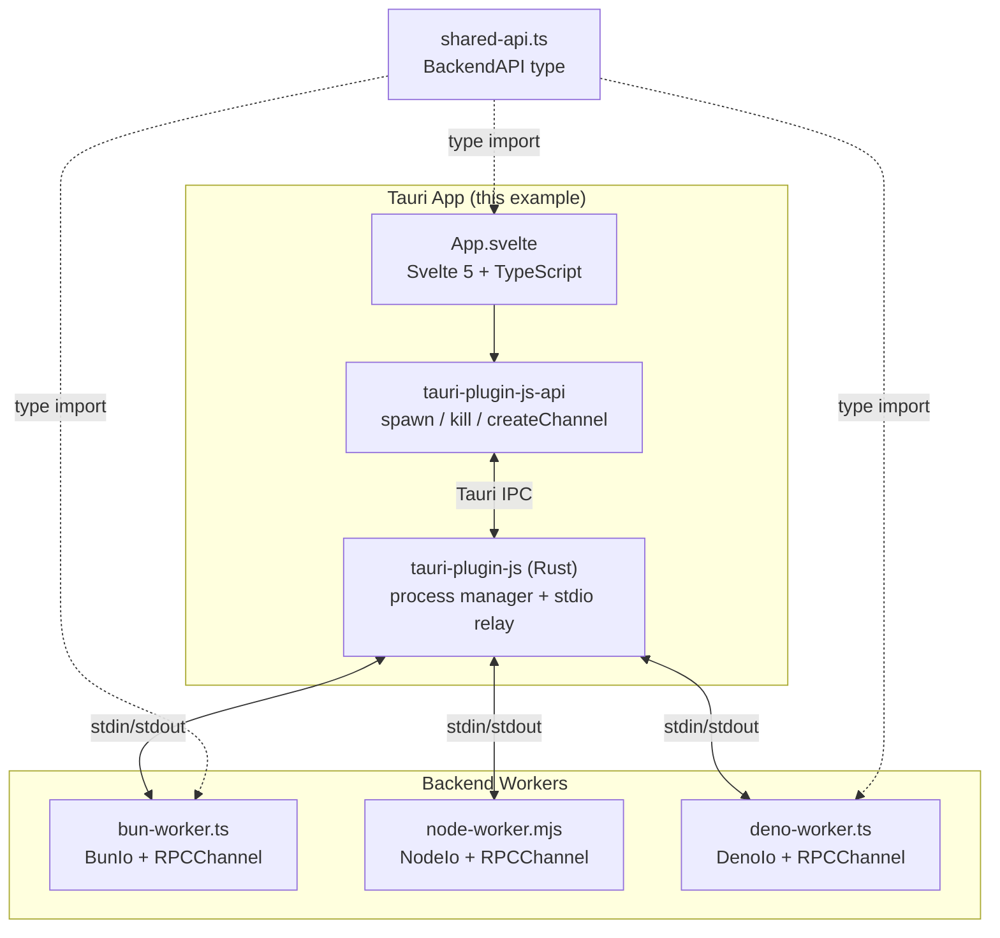
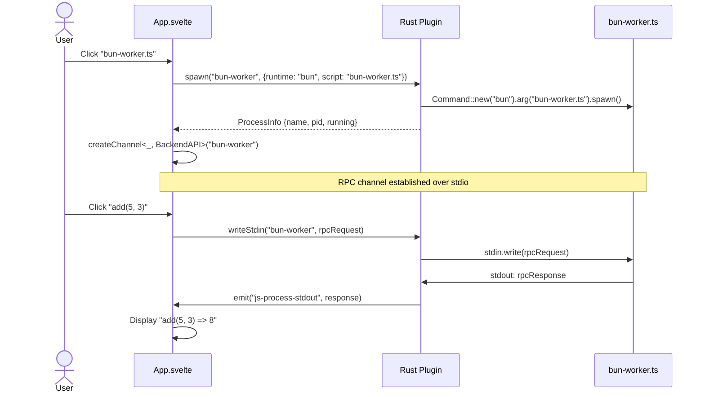

# Example: JS Runtime Manager

A demo app for `tauri-plugin-js` showing process management, type-safe RPC, and runtime detection across Bun, Node.js, and Deno.

## Prerequisites

- [Rust](https://rustup.rs/) toolchain
- [Tauri v2 CLI](https://tauri.app/start/): `cargo install tauri-cli`
- [pnpm](https://pnpm.io/)
- At least one JS runtime installed: [Bun](https://bun.sh/), [Node.js](https://nodejs.org/), or [Deno](https://deno.com/)

## Setup

From the **plugin root** (`tauri-plugin-js/`):

```bash
# Install plugin JS dependencies and build guest-js
pnpm install
pnpm build

# Install example app dependencies
cd examples/tauri-app
pnpm install
```

## Run

```bash
cd examples/tauri-app
pnpm tauri dev
```

## How it works





## What the app does

### Spawn section
Three spawn buttons (bun, node, deno) with live runtime detection:
- Green dot + version string = runtime found on `$PATH`
- Red dot + "not found" = runtime not installed (button disabled)

Clicking a button spawns the corresponding worker script (`backends/bun-worker.ts`, `backends/node-worker.mjs`, or `backends/deno-worker.ts`) as a child process managed by the plugin.

### Process list
Shows all running processes with PID, restart, and kill buttons. Updates via polling.

### RPC calls
Once a process is running and its RPC channel is established, four typed call buttons appear:
- `add(5, 3)` — arithmetic
- `echo("hello")` — string echo with runtime prefix
- `getSystemInfo()` — returns runtime name, PID, platform, arch
- `fibonacci(10)` — compute

All calls are **type-safe** against the shared `BackendAPI` interface at compile time.

### Output log
Real-time log panel showing stdout, stderr, exit events, RPC results, and system messages. Color-coded by type.

### Settings dialog
Click "settings" in the header to open the runtime settings modal:
- Shows detected path and version for each runtime
- Allows overriding executable paths (e.g., point to a specific nvm-managed node)
- "Refresh detection" button to re-scan

### Multi-window
Click "+ window" to open another instance of the app. All windows share the same backend processes and can make independent RPC calls.

## Project structure

```
examples/tauri-app/
  backends/
    shared-api.ts       # BackendAPI type definition (shared between frontend + workers)
    bun-worker.ts       # Bun worker using kkrpc BunIo
    node-worker.mjs     # Node worker using kkrpc NodeIo
    deno-worker.ts      # Deno worker using kkrpc DenoIo
  src/
    App.svelte          # Main UI (Svelte 5, TypeScript)
    main.js             # Entry point
    app.css             # Tailwind + theme tokens
  src-tauri/
    src/lib.rs          # Tauri app setup with plugin registration
    capabilities/       # Permissions (js:default, core:webview, etc.)
    tauri.conf.json     # App config
```

## Troubleshooting

**"not found" for a runtime you have installed:**
The plugin runs `which <runtime>` and `<runtime> --version`. If your runtime is installed via a version manager (nvm, fnm, etc.), its path may not be in the shell environment Tauri inherits. Use the settings dialog to set a custom executable path.

**Vite cache issues after rebuilding the plugin:**
If imports fail with `SyntaxError: Importing binding name '...' is not found`, delete the Vite pre-bundle cache and reinstall:

```bash
rm -rf node_modules/.vite
pnpm install
```
